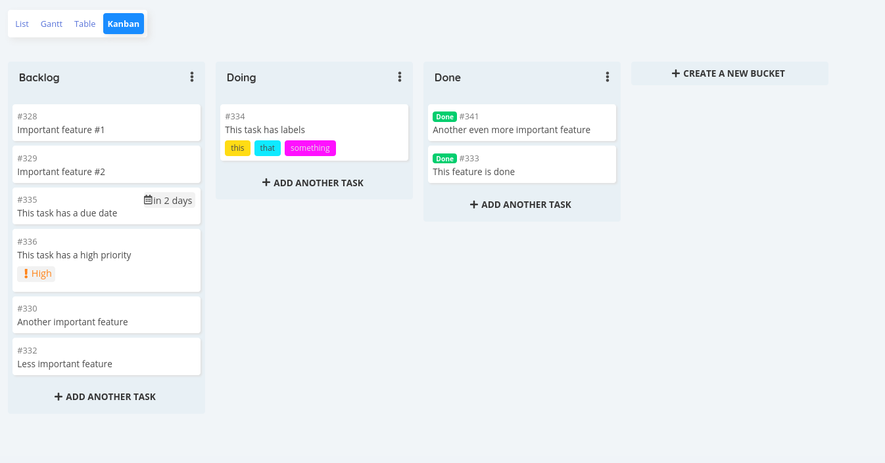

<!--
N.B.: This README was automatically generated by https://github.com/YunoHost/apps/tree/master/tools/README-generator
It shall NOT be edited by hand.
-->

# Vikunja pour YunoHost

[](https://dash.yunohost.org/appci/app/vikunja)  

[](https://install-app.yunohost.org/?app=vikunja)

*[Read this readme in english.](./README.md)*

> *Ce package vous permet d’installer Vikunja rapidement et simplement sur un serveur YunoHost.
Si vous n’avez pas YunoHost, regardez [ici](https://yunohost.org/#/install) pour savoir comment l’installer et en profiter.*

## Vue d’ensemble

Vikunja est une application de liste de tâches Open Source auto-hébergée pour toutes les plateformes.

### Features

- Stay organized 
- Collaborate with peers
- Tasks  
- Kanban board
- CalDAV
- Links  

**Version incluse :** 0.21.0~ynh3

**Démo :** https://try.vikunja.io/login

## Captures d’écran



## Documentations et ressources

* Site officiel de l’app : <https://vikunja.io/>
* Documentation officielle de l’admin : <https://vikunja.io/docs/>
* Dépôt de code officiel de l’app : <https://kolaente.dev/vikunja/>
* Documentation YunoHost pour cette app : <https://yunohost.org/app_vikunja>
* Signaler un bug : <https://github.com/YunoHost-Apps/vikunja_ynh/issues>

## Informations pour les développeurs

Merci de faire vos pull request sur la [branche testing](https://github.com/YunoHost-Apps/vikunja_ynh/tree/testing).

Pour essayer la branche testing, procédez comme suit.

``` bash
sudo yunohost app install https://github.com/YunoHost-Apps/vikunja_ynh/tree/testing --debug
ou
sudo yunohost app upgrade vikunja -u https://github.com/YunoHost-Apps/vikunja_ynh/tree/testing --debug
```

**Plus d’infos sur le packaging d’applications :** <https://yunohost.org/packaging_apps>